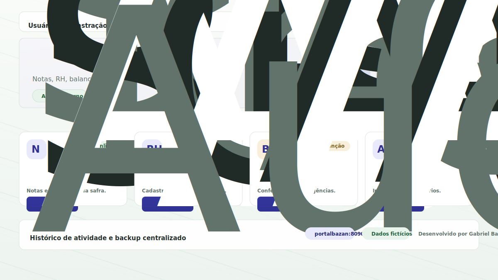
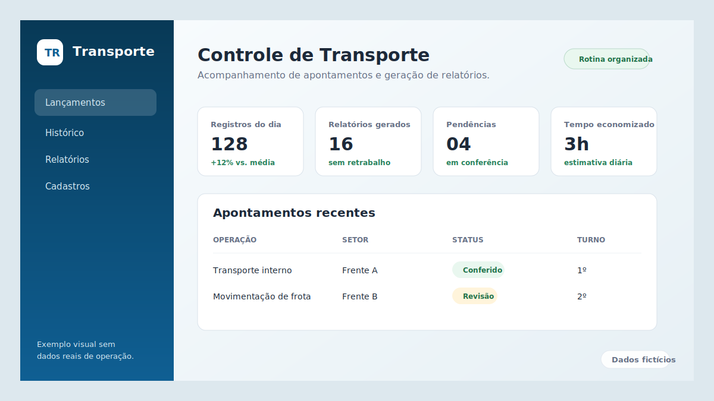
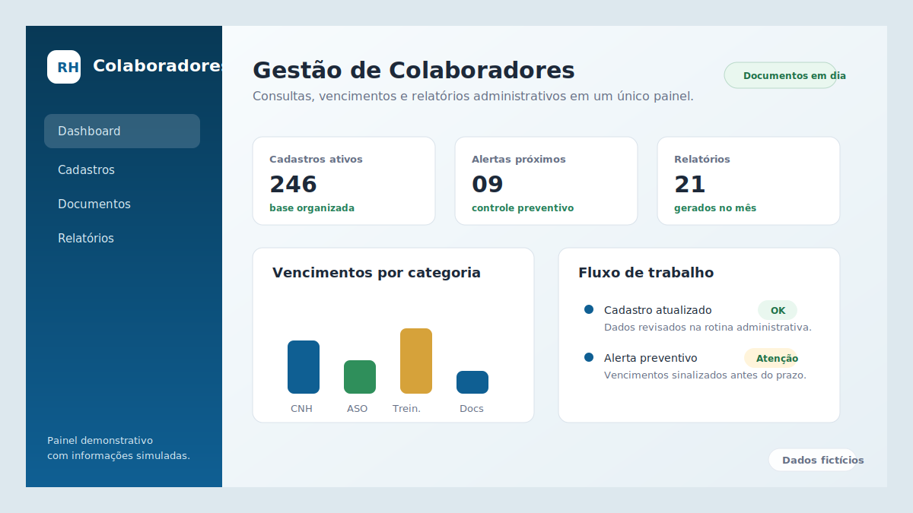
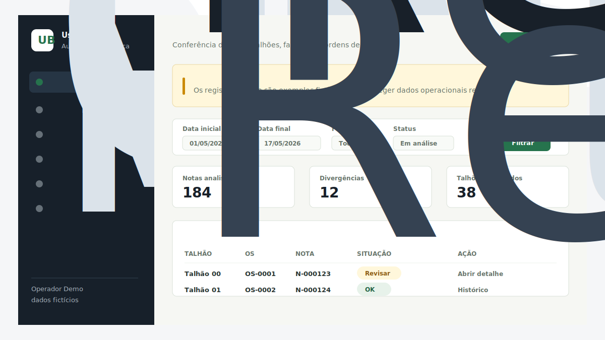

# Portfólio de Sistemas Internos e Automação

Este repositório apresenta estudos de caso de sistemas internos, automações e melhorias de processos desenvolvidos para apoiar rotinas administrativas e operacionais no setor sucroenergético.

As soluções foram criadas para substituir controles manuais, organizar informações, facilitar consultas, gerar relatórios e centralizar o acesso a ferramentas internas.

O objetivo é mostrar minha evolução como estudante de Sistemas de Informação e desenvolvedor em formação, conectando problemas reais do ambiente de trabalho com soluções práticas usando tecnologia.

## Visão geral

Os projetos apresentados fazem parte de um ecossistema interno criado para apoiar a rotina da operação, melhorar a organização dos dados e facilitar o acesso aos sistemas usados no dia a dia.

> Por envolver processos internos, regras de negócio e possíveis informações sensíveis, o código-fonte dos sistemas reais permanece privado. Este repositório contém apenas uma visão pública e segura dos projetos.

## Projetos apresentados

| Projeto | Objetivo |
| --- | --- |
| Portal interno e launcher de sistemas | Centralizar o acesso às ferramentas internas e organizar a navegação entre os sistemas. |
| Sistema de transporte e apontamentos | Apoiar o controle de informações operacionais, apontamentos e relatórios. |
| Gestão de colaboradores | Organizar cadastros, documentos, consultas e relatórios administrativos. |
| Auditoria de balança | Apoiar verificações, análises de divergências e acompanhamento de registros operacionais. |
| Análises operacionais | Transformar dados operacionais em relatórios, consultas e indicadores de acompanhamento. |

## Telas demonstrativas

As imagens abaixo foram baseadas na estrutura visual dos sistemas reais, mas usam apenas dados fictícios e conteúdo genérico. Elas foram criadas para apresentação pública do portfólio e não exibem dados reais, código-fonte, relatórios internos ou informações sensíveis.

## Portal interno e launcher de sistemas

Portal central para organizar o acesso aos principais sistemas internos em uma única interface.

Principais pontos:

- acesso centralizado aos sistemas usados na rotina;
- padronização visual entre ferramentas internas;
- organização de atalhos e inicialização dos sistemas;
- apoio ao uso em rede local;
- base para auditoria, histórico de atividade e backup centralizado.

## Sistema de transporte e apontamentos

Sistema voltado ao controle de informações operacionais relacionadas a transporte, apontamentos e relatórios.

Principais pontos:

- substituição de controles manuais por uma aplicação estruturada;
- cadastro, consulta e histórico de informações;
- geração de relatórios operacionais;
- organização de dados para análise e acompanhamento.

## Gestão de colaboradores

Sistema para apoiar rotinas administrativas relacionadas a colaboradores, documentos, consultas e relatórios.

Principais pontos:

- centralização de cadastros;
- consultas e filtros de informações;
- apoio ao controle de documentos e vencimentos;
- relatórios para acompanhamento administrativo.

## Auditoria de balança

Aplicação para apoiar verificações, análises e auditoria de informações relacionadas à pesagem e a processos operacionais.

Principais pontos:

- organização de registros operacionais;
- análise de divergências;
- importação e tratamento de dados;
- apoio a relatórios e indicadores.

## Análises operacionais

Conjunto de ferramentas para transformar dados operacionais em relatórios, consultas e painéis de acompanhamento.

Principais pontos:

- tratamento de dados a partir de arquivos e bases locais;
- relatórios gerenciais;
- indicadores para acompanhamento da operação;
- apoio à tomada de decisão no dia a dia.

## Tecnologias e conhecimentos aplicados

- Python
- Flask
- SQLite
- JavaScript
- HTML e CSS
- React
- Node.js
- SQL
- Git e GitHub
- Automação de processos
- Geração de relatórios
- Organização e modelagem de dados

## Minha atuação

Atuei por iniciativa própria na identificação de oportunidades de melhoria, na organização dos fluxos, no desenvolvimento das primeiras soluções e na evolução das ferramentas conforme as necessidades do dia a dia.

As atividades envolveram:

- levantamento de problemas em rotinas administrativas e operacionais;
- desenvolvimento de interfaces e fluxos de uso;
- criação de automações para reduzir tarefas repetitivas;
- estruturação de dados e consultas;
- geração de relatórios;
- testes em ambiente local;
- ajustes com base no uso real das ferramentas.

## Cuidados com privacidade

Este repositório não contém:

- código-fonte dos sistemas reais;
- bancos de dados;
- planilhas internas;
- PDFs, relatórios ou documentos da empresa;
- logs de execução;
- credenciais, tokens ou arquivos de ambiente;
- nomes, documentos ou dados pessoais;
- informações operacionais sensíveis.

O conteúdo público foi pensado para demonstrar o raciocínio técnico, as tecnologias utilizadas e o impacto das soluções, preservando a segurança das informações.

## Aprendizados

Esses projetos fortaleceram minha base em desenvolvimento de software aplicado a problemas reais, principalmente em:

- transformar processos manuais em sistemas organizados;
- pensar em usabilidade para pessoas que usam ferramentas no trabalho diário;
- criar soluções simples antes de evoluir para arquiteturas mais completas;
- lidar com dados, relatórios e regras de negócio;
- conectar estudos de Sistemas de Informação com necessidades reais de uma empresa.

## Próximos passos

- Criar diagramas simples da arquitetura dos sistemas.
- Documentar estudos de caso individuais com problema, solução e resultado.
- Adicionar novas telas demonstrativas conforme os projetos evoluírem.

## Contato

- GitHub: [github.com/gabrisantoss](https://github.com/gabrisantoss)
- LinkedIn: [Gabriel Santos](https://www.linkedin.com/in/gabriel-santos-49874a356)
